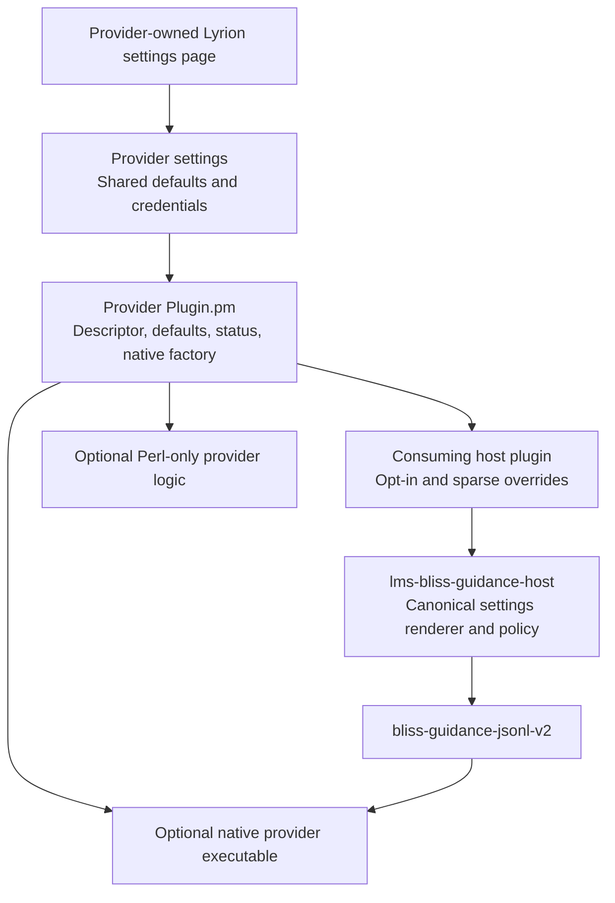
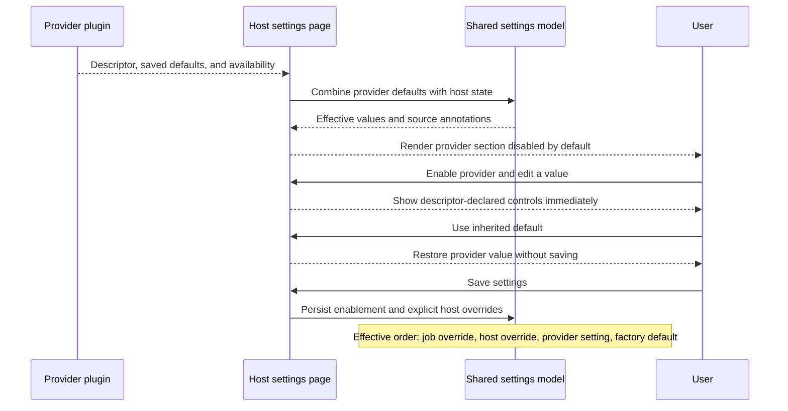
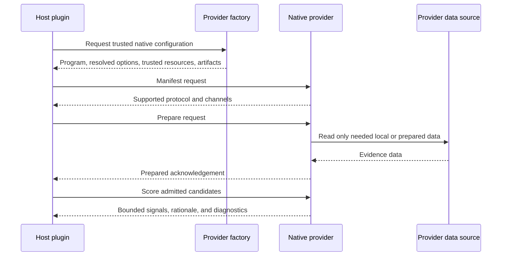

# Guidance provider architecture

This kit defines the shape of an independently installable Lyrion guidance
provider. A provider contributes optional, bounded evidence to candidates that
a host has already accepted through its Bliss-based selection. It cannot add
candidates, replace the host algorithm, or relax repeat and quality rules.

## Static provider anatomy

A provider may be Perl-only. A native executable is appropriate when bounded
candidate scoring is high-volume or needs a language-neutral SPI; it is not a
requirement for discovery or settings integration.

## Discovery, opt-in, and effective settings

The provider controls whether a field is a slider or a simple numeric input
through its descriptor. Hosts render it unchanged, including the canonical
provider-settings link, effective-value annotation, and inherited-default
behaviour.

## Native provider execution

Settings form values never supply an executable path, database path, or
network destination. The provider factory derives all such values from trusted
plugin resources and the resolved policy.
