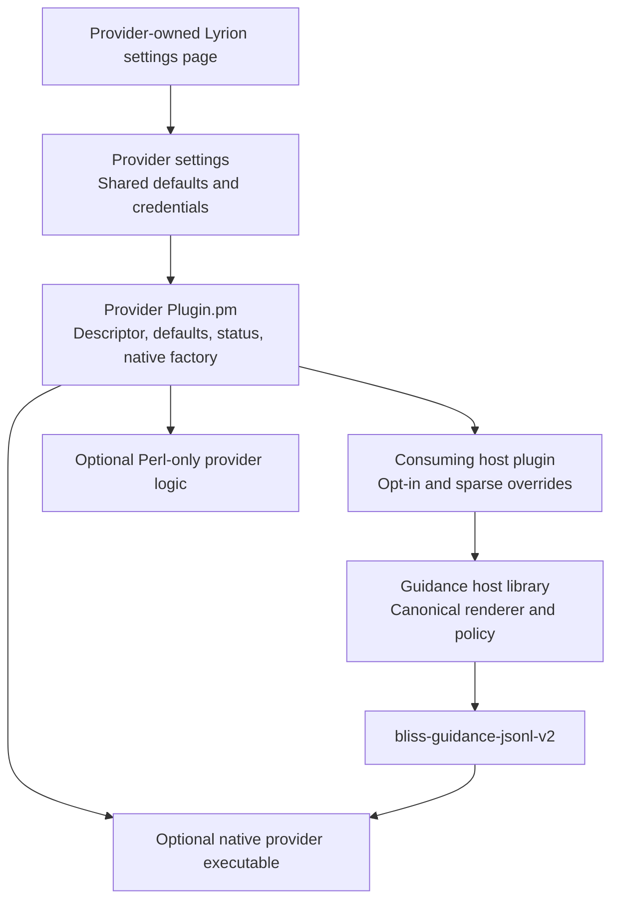
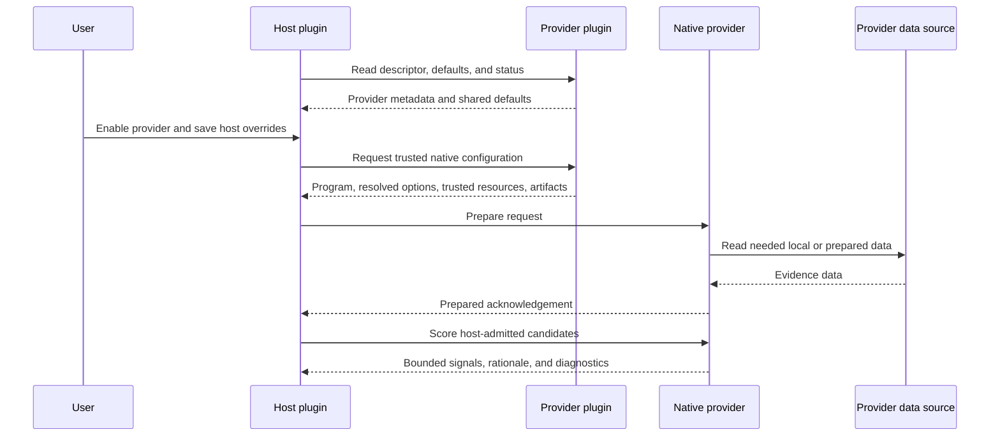

# Lyrion Bliss Guidance Provider Kit

This repository is the starting point for independently installable Lyrion
guidance providers. A provider supplies bounded secondary evidence to a host's
existing Bliss-qualified candidate pool; it never admits a track or bypasses a
host's repeat and quality constraints.

Use the kit for configuration-only Perl providers, language-neutral JSONL
providers, or high-volume Rust providers. The native protocol is owned by
[bliss-playlist-guidance-spi](https://github.com/chrober/bliss-playlist-guidance-spi).
The canonical host settings UI is owned by
[lms-bliss-guidance-host](https://github.com/chrober/lms-bliss-guidance-host).

## Provider anatomy

A provider may be Perl-only. A native executable is appropriate when bounded
candidate scoring is high-volume or needs a language-neutral SPI; it is not a
requirement for discovery or settings integration.

## Provider discovery and execution flow

The effective value order is: per-job override, host override, provider
setting, then factory default. **Use inherited default** changes the form and
its source annotation without saving; the ordinary host Save action persists
the chosen host state.

Read [the authoring guide](PROVIDER_AUTHORING_GUIDE.md), copy the template,
replace its example IDs, and retain its separate provider settings page.
