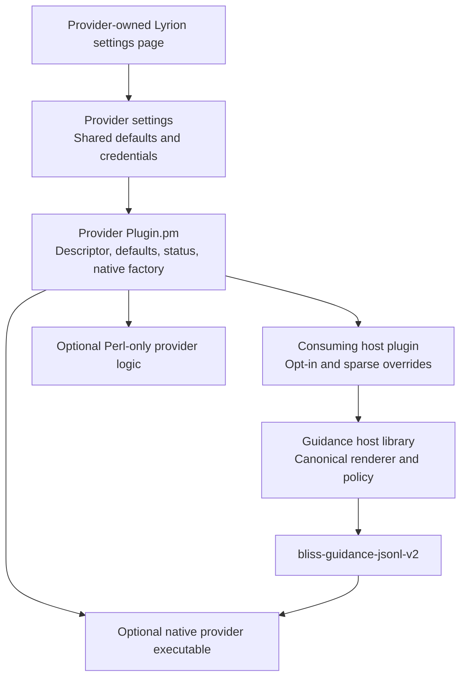
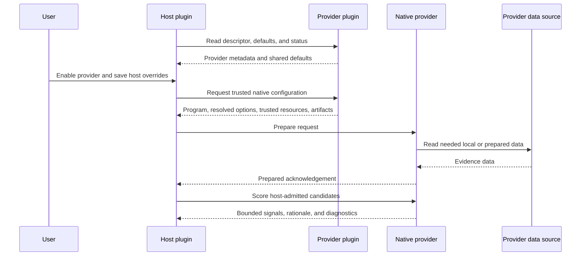

# Lyrion Bliss Guidance Provider Kit

This repository is the starting point for independently installable Lyrion
guidance providers. A provider supplies bounded secondary evidence to a host's
existing Bliss-qualified candidate pool; it never admits a track or bypasses a
host's repeat and quality constraints.

Use the kit for configuration-only Perl providers, language-neutral JSONL
providers, or high-volume Rust providers. The native protocol is owned by
[bliss-playlist-guidance-spi](https://github.com/chrober/bliss-playlist-guidance-spi).
The canonical host settings UI is owned by
[lms-bliss-guidance-host](https://github.com/chrober/lms-bliss-guidance-host).

## Reference implementation

[lms-guidance-library-signals](https://github.com/chrober/lms-guidance-library-signals)
is the reference implementation for this kit. It demonstrates the complete
provider shape: descriptor, defaults, status, provider-owned settings page,
host overrides, trusted native SPI configuration, and read-only local data
access.

The released Last.fm example is
[lms-guidance-lastfm](https://github.com/chrober/lms-guidance-lastfm). Its
working path is LastMix/artifact-backed; the provider-owned API Key control is
scaffolding for a future direct-acquisition implementation and is currently
neutral in native scoring.

## Provider anatomy

A provider may be Perl-only. A native executable is appropriate when bounded
candidate scoring is high-volume or needs a language-neutral SPI; it is not a
requirement for discovery or settings integration.

## Provider discovery and execution flow

The effective value order is: per-job override, host override, provider
setting, then factory default. **Use inherited default** changes the form and
its source annotation without saving; the ordinary host Save action persists
the chosen host state.

## Authoring a provider

### Choose the provider shape

- **Configuration-only Perl:** discovery, defaults, and lightweight local work.
- **JSONL executable:** any language implementing the native SPI.
- **Rust provider:** recommended for bounded, high-volume candidate scoring.

All shapes publish `guidance_provider_descriptor_v1`. The descriptor provides
stable identity, capabilities, settings schema, and safe native-backend
metadata. It does not contain raw HTML, JavaScript, CSS, or form callbacks.

### Settings ownership

Every provider has its own Lyrion settings page. It owns credentials, source
behaviour, diagnostics, and shared defaults. A consuming host owns whether the
provider is enabled and its sparse per-host overrides.

Hosts render provider controls from the descriptor. `render_as => 'slider'`
must stay a Material Skin slider; `render_as => 'number'` must stay a simple
number field. Do not build custom host markup for a provider.

### Native execution

Use the `bliss-guidance-jsonl-v2` contract for an executable provider. Trusted
host code supplies the program, artifacts, resources, and resolved options.
Never accept executable paths, database paths, or network destinations from
settings form values. Native providers return structured signals and
rationales; hosts localize logs and user-visible explanations.

### Testing and packaging

Copy the template, replace its example IDs, and retain its separate provider
settings page. Start from
`fixtures/provider-descriptor-v1-all-controls.json`. Add a provider contract
test for descriptor validity, defaults, status, and native configuration. Use
the standard settings footer so users always save explicitly. Package the
provider as an ordinary Lyrion extension; hosts discover enabled provider
modules at runtime and default them to disabled.
